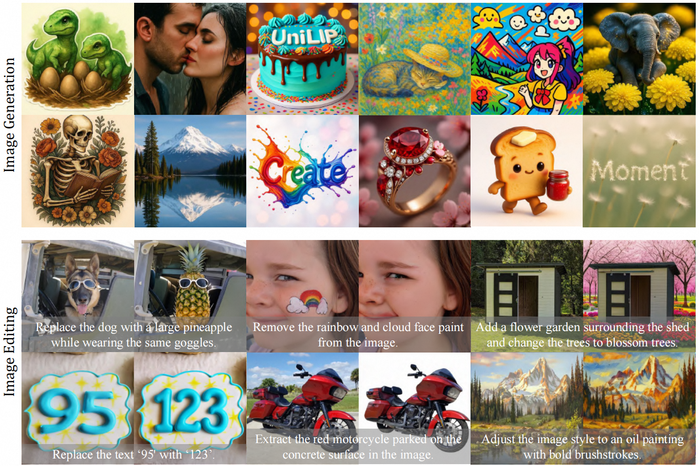

# UniLiP: Adapting CLIP for Unified Multimodal Understanding, Generation and Editing
<h5 align="center">

[](https://huggingface.co/papers/2507.23278)
[](https://www.arxiv.org/abs/2507.23278)
[](https://github.com/nnnth/UniLIP/blob/main/LICENSE) 

[](https://github.com/nnnth/UniLIP/issues)
[](https://github.com/nnnth/UniLIP/issues?q=is%3Aissue%20state%3Aclosed)  <br>
</h5>
<div align="center">
  
</div>

This repo is the official implementation of paper: [UniLiP: Adapting CLIP for Unified Multimodal Understanding, Generation and Editing](https://www.arxiv.org/abs/2507.23278) as well as the follow-ups. We have made every effort to ensure that the codebase is clean, concise, easily readable, state-of-the-art, and relies only on minimal dependencies.

> UniLiP: Adapting CLIP for Unified Multimodal Understanding, Generation and Editing
>
> [Hao Tang](https://scholar.google.com/citations?user=MyarrsEAAAAJ&hl=en), [Chenwei Xie](https://scholar.google.com/citations?hl=en&user=UHCDCRMAAAAJ) , [Xiaoyi Bao](https://scholar.google.com/citations?hl=en&user=gSI_eiIAAAAJ), [Tingyu Weng](https://scholar.google.com/citations?user=BN2Ze-QAAAAJ&hl=en&oi=ao), [Pandeng Li](https://lpdone.github.io/), [Yun Zheng](https://scholar.google.com/citations?user=z76PBfYAAAAJ&hl=en)$^\dagger$, [Liwei Wang](https://scholar.google.com/citations?user=VZHxoh8AAAAJ&hl=en) $^\dagger$
> - Primary contact: Hao Tang ( tanghao@stu.pku.edu.cn )

## 📣 News
- [25-10-9] 🚀 All [checkpoints](https://huggingface.co/kanashi6/UniLIP-3B), training and inference Code is released.
- [25-7-31] 👀 UniLIP is released on [arXiv](https://www.arxiv.org/abs/2507.23278).

## Overview
<!-- - [👀 Todo](https://github.com/nnnth/UniLIP?tab=readme-ov-file#-todo) -->
- [🤔 Introduction](https://github.com/nnnth/UniLIP?tab=readme-ov-file#-introduction)
- [🚀 Main Results](https://github.com/nnnth/UniLIP?tab=readme-ov-file#-main-results)
- [🛠️ Quick Start](https://github.com/nnnth/UniLIP?tab=readme-ov-file#%EF%B8%8F-quick-start)
- [👍 Acknowledgments](https://github.com/nnnth/UniLIP?tab=readme-ov-file#-acknowledgement)
- [📘 Citation](https://github.com/nnnth/UniLIP?tab=readme-ov-file#-citation)


## 🤔 Introduction
Previous CLIP-based unified methods fail to balance understanding and reconstruction, leading to semantic degradation or inconsistent reconstructions. To overcome this, we propose UniLIP:
- **Two-Stage Self-Distillation**: A novel training scheme that teaches CLIP high-fidelity reconstruction without degrading its powerful comprehension abilities.
- **Dual-Condition Architecture**: Enhances reasoning and edit consistency by combining rich multimodal context with learnable queries that harness the power of MLLMs.
- **State-of-the-Art Performance**: Achieves top results on GenEval (0.88/0.90), WISE (0.56/0.63), and ImgEdit (3.81/3.94) with efficient 1B/3B models, demonstrating superior instruction following and edit fidelity.

## 🚀 Main Results

### Image Reconstruction on ImageNet val

| Model | Res. | ratio | rFID ↓ | PSNR↑ | SSIM↑ |
| :--- | :--- | :--- | :--- | :--- | :--- |
| VILA-U | 256 | 16 | 1.80 | - | - |
| Tokenflow | 256 | 16 | 1.37 | 21.41 | 0.687 |
| DualViTok | 256 | 16 | 1.37 | 22.53 | 0.741 |
| **UniLIP** | 256 | 32 | **0.79** | **22.99** | **0.747** |
| Emu2 | 448 | 14 | 3.27 | 13.49 | 0.423 |
| **UniLIP** | 448 | 32 | **0.31** | **24.62** | **0.788** |
 

### Image Understanding
| Model | # LLM Params | MME-P | MMB | MMMU | MM-Vet | SEED | AI2D | MMVP |
| :--- | :--- | :--- | :--- | :--- | :--- | :--- | :--- | :--- |
| InternVL3-1B | 1B | 1492 | 72.6 | 43.4 | 59.5 | 71.1 | 69.4 | 67.3 |
| InternVL3-2B | 1.8B | 1633 | 80.6 | 48.2 | 62.2 | 75.0 | 78.5 | 72.7 |
| BAGEL-3B | 3B | 1610 | 79.2 | 43.2 | 48.2 | - | - | 54.7 |
| BLIP3o-4B | 4B | 1528 | 78.6 | 46.6 | 60.1 | 73.8 | - | - |
| TokLIP-7B | 7B | 1410 | - | 42.1 | - | 65.2 | - | - |
| Tar-7B | 7B | 1571 | 74.4 | 39.0 | | 73.0 | - | - |
| **UniLIP-1B** | 1B | 1499 | 72.6 | 43.3 | 59.4 | 71.0 | 70.7 | 68.7 |
| **UniLIP-3B** | 2B | **1636** | **80.7** | **48.7** | **62.2** | **75.0** | **78.6** | **73.0** |


### Image Generation and Editing
| Model | # Params | GenEval | WISE  | ImgEdit |
| :--- | :--- | :--- | :--- | :--- |
| BAGEL | 7B+7B | 0.82 | 0.52 | 3.20 |
| BLIP3o-4B | 3B+1.4B | 0.81 | 0.50 | - |
| UniWorld-V1 | 7B+12B | - | - | 3.26 |
| **UniLIP-1B** | 1B+0.6B | 0.88 | 0.56 | 3.81 |
| **UniLIP-3B** | 2B+1.6B | **0.90** | **0.63** | **3.94** |


## 🛠️ Quick Start
### Installation

```shell
conda create -n UniLIP python=3.11
conda activate UniLIP
pip install torch==2.6.0+cu118 torchvision==0.21.0+cu118 --index-url https://download.pytorch.org/whl/cu118
pip install -r requirements.txt
pip install -e .
```


### Demo
Please download checkpoints [UniLIP-1B](https://huggingface.co/kanashi6/UniLIP-1B) and [UniLIP-3B](https://huggingface.co/kanashi6/UniLIP-3B), then save them under root dir:
```
UniLIP
|──UniLIP-1B
|──UniLIP-3B
|──...
```

Run demo on image generation:
```shell
python scripts/inference_gen.py ./UniLIP-3B
```

Run demo on image editing
```shell
python scipts/inference_edit.py ./UniLIP-3B

```

### Scripts
For Training and evaluation commands, please refer [TRAIN.md](https://github.com/nnnth/UniLIP/blob/main/TRAIN.md) and [EVAL.md](https://github.com/nnnth/UniLIP/blob/main/EVAL.md)

## 👍 Acknowledgement
* [TiTok](https://github.com/bytedance/1d-tokenizer) We implement reconstruction training following TiTok.
* [BLIP3-o](https://github.com/JiuhaiChen/BLIP3o/tree/main) Thanks to BLIP3-o for providing the generation data and training code.
* [InternVL](https://github.com/OpenGVLab/InternVL) We use InternVL3 as the MLLM pretraining.
* [SANA](https://github.com/NVlabs/Sana) We use SANA as the DiT pretraining.
* [DC-AE](https://github.com/mit-han-lab/efficientvit) We use the pixel decoder from DC-AE.

## 📘 Citation
Please consider citing our work as follows if it is helpful.
```
@article{tang2025unilip,
  title={UniLiP: Adapting CLIP for Unified Multimodal Understanding, Generation and Editing},
  author={Tang, Hao and Xie, Chenwei and Bao, Xiaoyi and Weng, Tingyu and Li, Pandeng and Zheng, Yun and Wang, Liwei},
  journal={arXiv preprint arXiv:2507.23278},
  year={2025}
}
```

## ✨ Star History
[](https://www.star-history.com/#nnnth/UniLIP&Date)


